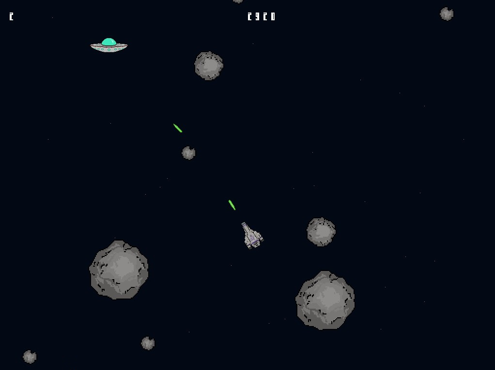
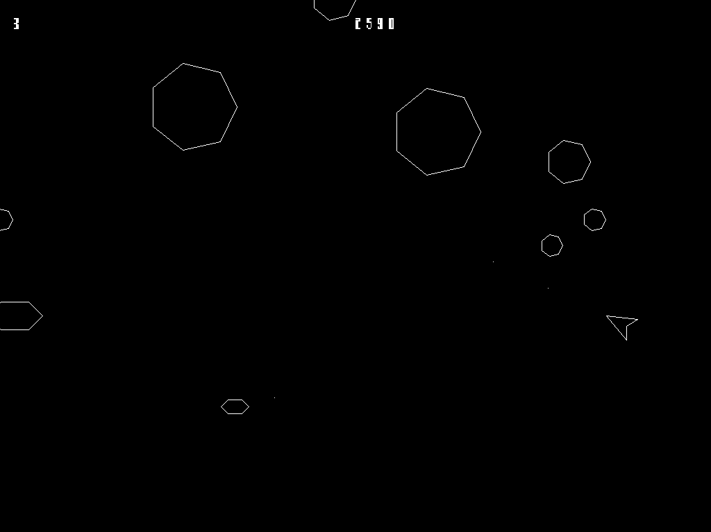

# Game Development in Haskell

There are two Atari Asteroids clones I created for
the purposes of my thesis about gamedev in Haskell.

They both differ from the original in some ways,
more about them beneath the installation instructions.

### The thesis
The pdf document is in the root direcotry of the repository.
There is also a [submodule](https://github.com/honzaflash/ba-thesis-tex/tree/f17bef03e3f3e066e09cb174e3ec07f2ef2d74ee)
with all the sources the pdf was built from using LaTeX.

The thesis as it was submitted is also available with reviews of the supervisor and the reader
in the [MUNI archive](https://is.muni.cz/th/zedur/?lang=en) with all of its atachments.
Despite some room for improvement, the defense was successful and the thesis received an **A**.

## Installation of the games

The [Haskell Tool Stack](https://docs.haskellstack.org/en/stable/GUIDE/)
is required for installation.
You also need the `SDL` libraries, which can be installed like this:
-  On Ubuntu
    ```
    sudo apt install libsdl2-dev libsdl2-ttf-dev libsdl2-image-dev
    ```
 - On Windows
    ```
    stack exec -- pacman -S mingw64/mingw-w64-x86_64-pkg-config mingw64/mingw-w64-x86_64-SDL2 mingw64/mingw-w64-x86_64-SDL2_ttf mingw64/mingw-w64-x86_64-SDL2_image
    ```
Note: you don't need SDL Image if you are only interested in
trying pure-asteroids.

If you have the SDL libraries, run `stack build` in the directory of the game you want to install. This may take *a while*.
`stack exec name-of-the-executable` (I find this process
doesn't work on my windows machine for some reason
that I haven't looked into yet).
-  On Ubuntu
    ```
    stack build
    stack exec <project-name>-exe
    ```
 - On Windows
    ```
    stack build
    stack exec <project-name>-exe
    ```
    For some reason I have issues with `stack build` on Windows
    so alternatively, you can use `stack ghci` and
    run the `main` function yourself from there.

    ```
    stack ghci
    main
    ```

## About the games

Both games are decently close to the original Asteroids
but there are several details that are different
or not implemented. Both games have identical features with
the exception of hAsteroids using loaded textures and
pure-asteroids drawing lines in the code instead.
The gameplay is slighly different but
the rules and general behaviour is the same.

- ## hAsteroids
    Clone of Atari Asteroids using apecs.

    

    Serves as an example of monad-everything aproach.

    Currently in a "good enough" state.

    Could use some refactoring.

- ## pure-asteroids
    Clone of Atari Asteroids with focus on
    safe pure functions and "pure" vector graphics :)

    
    
    Serves as an example of "monad bad" extreme approach.

    Currently in a "good enough" state.

    Some refactoring is needed and there is few features
    I consider optional for the purposes of my thesis
    but which would be nice.

For more details look into the thesis :)

## Acknowledgements

- [Dino Rush](http://jxv.io/blog/2018-02-28-A-Game-in-Haskell.html) -
great blog post about a great attempt at Haskell gamedev

- [Ashley Smith's blog](https://aas.sh/blog/making-a-game-with-haskell-and-apecs/)
that has a lot of insight on games in Haskell and Apecs

- Font used: [Computer Speak](https://fontlibrary.org/en/font/computer-speak#Computer%20Speak%20v0.3-Regular) by Shaan Sawrup

- [SDL2 bindings for Haskell](https://github.com/haskell-game/sdl2)

- [Apecs:](https://github.com/jonascarpay/apecs) a fast, type-driven Entity-Component-System library for game programming by Jonas Carpay
    - with a great [demo/tutorial](https://github.com/jonascarpay/apecs/blob/master/examples/Shmup.md)

## Interesting "bedtime" reads/watches :)

- The famous [*Why Functional Programming Matters*](https://academic.oup.com/comjnl/article-pdf/32/2/98/1445644/320098.pdf)
- [*Monads For Functional Programming*](http://staff.um.edu.mt/afra1/seminar/monads.pdf)
- Simon P. Jones' talk - [Escape from the ivory tower: the Haskell journey](https://youtu.be/re96UgMk6GQ) 
