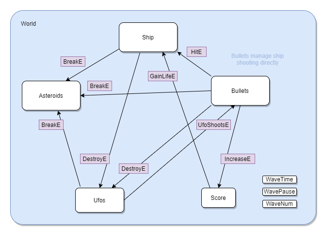
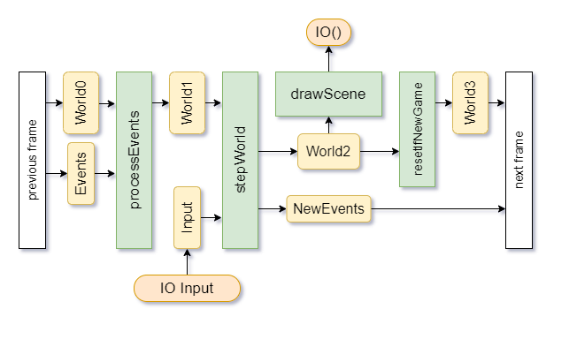
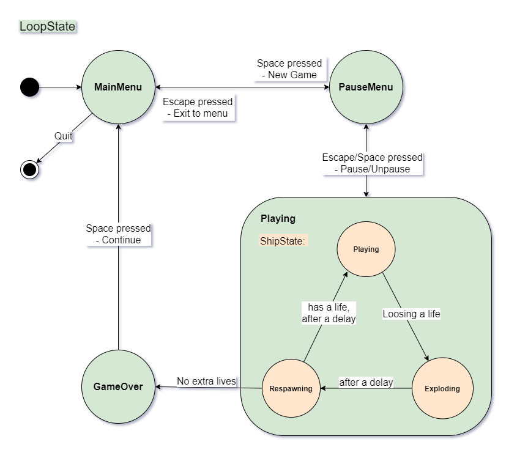

# pure-asteroids

An attempt of making an Atari Asteroids clone
without any fancy game dev oriented libraries

Main focus here is to separate side effects from data
transformation and keeping state variables relatively independent
to allow potential paralelization.

The game is now in a "good enough" state for the purposes
of my thesis.
Howerever, there are several features that...
## Would be nice
- The actual parallelism
- Ufos moving randomly along the y axis
- Define classes for common operations
- Wrap some of the things in Reader monad (like SDL.Renderer!)
- **Lots more refactoring**
- Tweaking the constants to make the behaviour more
  true to the original
- Change other minor behaviours that are different in my version
  from the original

## How it works
The game world variable goes through 2 functions that alter it
every frame / loop iteration: `processEvents` and `stepWorld`.

`stepWorld` updates positions, reacts to keyboard input and generates `WorldEvents` that are then processed next frame
by the `processEvents` function.

`stepWorld` is decomposed into `step<EntityCollection>`
functions that could run in parallel.
For one entity from collection A to alter other from collection B,
it must send a request in form of an event that will be processed
next frame by the `process<EntityCollectionB>Events`.

This way the functions for the individual entity collections
could run in parallel with one sync point every frame, where
the events are exchanged.

`drawWorld` is separate and only reads the data, can't alter it.

Here's how the separate entity collections communicate together:

This is the flow of data in `gameLoop`:

And here's one more diagram :O with a pseudo-state-machine of
the main game loop (`LoopState`) and the ship (`ShipSate`):

