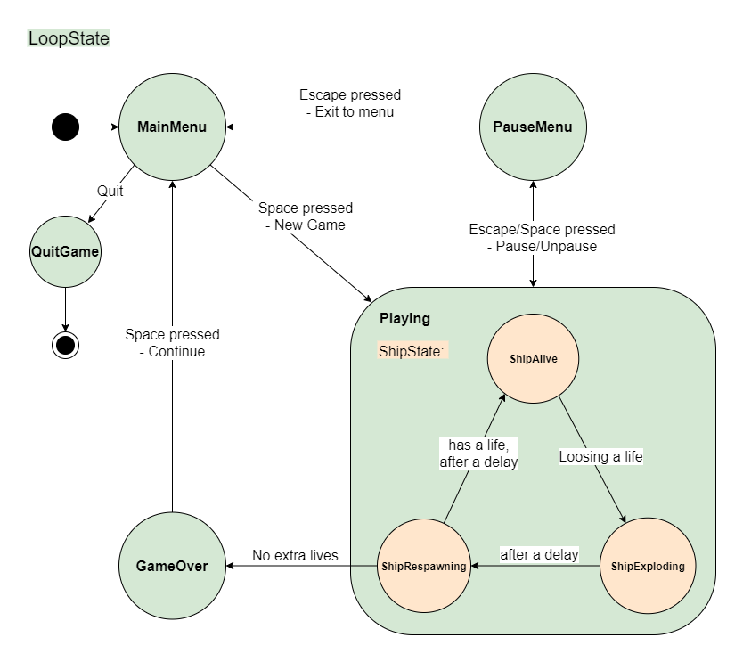

# pure-asteroids

An attempt of making an Atari Asteroids clone
without any fancy game dev oriented libraries

main focuse here is to separate effects from data
and keeping state variables relatively independent
to allow potential paralelization

here's how the separate entity collections communicate together:

And here are the states that the main game loop and the ship can be in:

